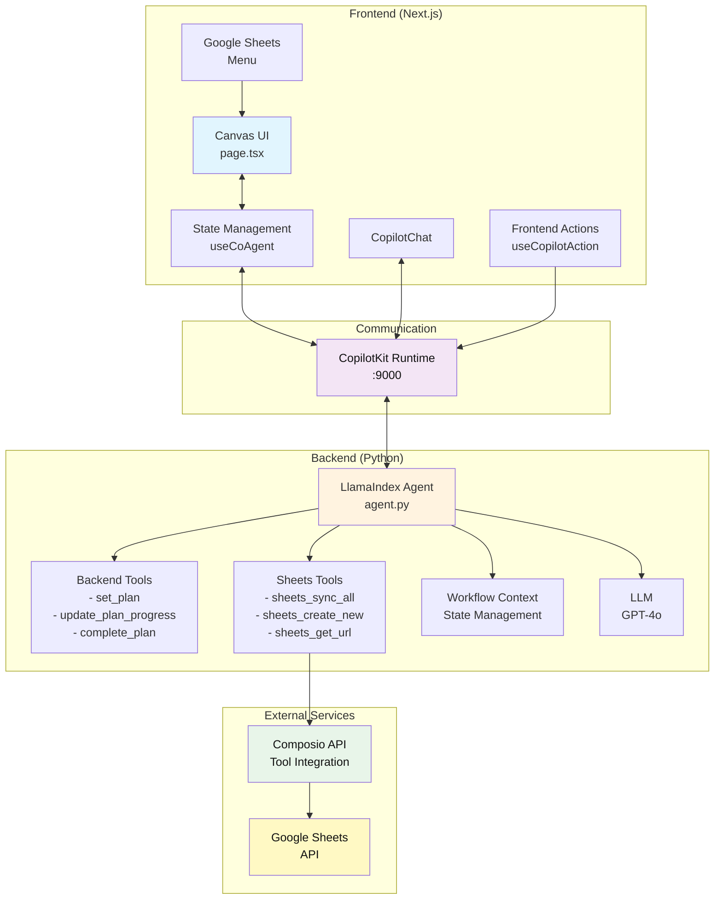
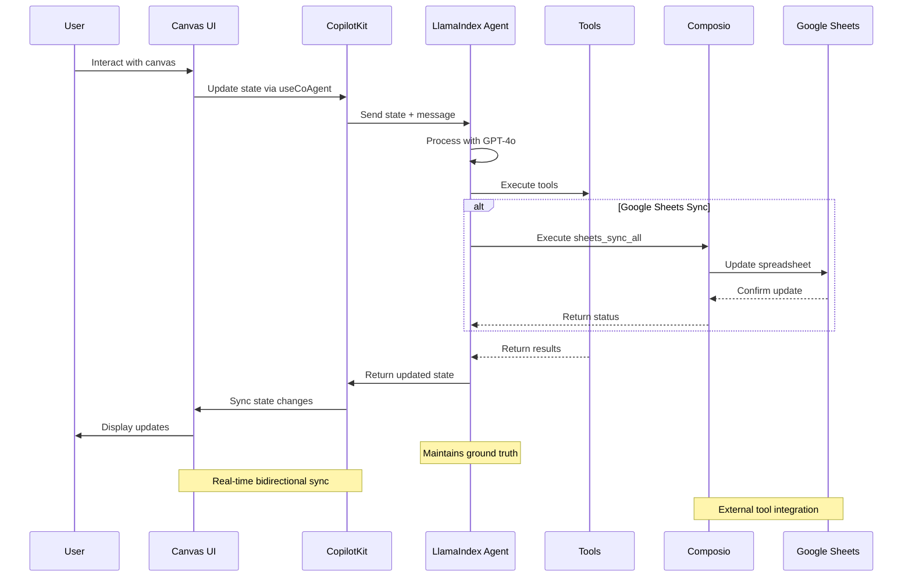

# CopilotKit <> LlamaIndex AG-UI Canvas with Composio

This is a starter template for building AI-powered canvas applications using [LlamaIndex](https://llamaindex.ai), [CopilotKit](https://copilotkit.ai), and [Composio](https://composio.dev). It provides a modern Next.js application with an integrated LlamaIndex agent that manages a visual canvas of interactive cards with real-time AI synchronization and external tool integrations through Composio.

https://github.com/user-attachments/assets/2a4ec718-b83b-4968-9cbe-7c1fe082e958

## 🚀 Key Features

- **Visual Canvas Interface**: Drag-free canvas displaying cards in a responsive grid layout
- **Four Card Types**: 
  - **Project**: Includes text fields, dropdown, date picker, and checklist
  - **Entity**: Features text fields, dropdown, and multi-select tags
  - **Note**: Simple rich text content area
  - **Chart**: Visual metrics with percentage-based bar charts
- **Real-time AI Sync**: Bidirectional synchronization between the AI agent and UI canvas
- **External Tool Integration**: Powered by Composio for seamless integration with external services
- **Google Sheets Sync**: Automatically sync canvas items to Google Sheets with one-way data flow
- **Multi-step Planning**: AI can create and execute plans with visual progress tracking
- **Human-in-the-Loop (HITL)**: Intelligent interrupts for clarification when needed
- **JSON View**: Toggle between visual canvas and raw JSON state
- **Responsive Design**: Optimized for both desktop (sidebar chat) and mobile (popup chat)

## Prerequisites

- Node.js 18+ 
- Python 3.8+
- OpenAI API Key (LlamaIndex agent; `agent/.env`) ([platform.openai.com/api-keys](https://platform.openai.com/api-keys))
- Composio API Key & Config ID (external tool integrations; `agent/.env`) ([app.composio.dev/developers](https://app.composio.dev/developers))
- [uv](https://docs.astral.sh/uv/getting-started/installation/)
- Any of the following package managers:
  - [pnpm](https://pnpm.io/installation) (recommended)
  - npm
  - [yarn](https://classic.yarnpkg.com/lang/en/docs/install/#mac-stable)
  - [bun](https://bun.sh/)

> **Note:** This repository ignores lock files (package-lock.json, yarn.lock, pnpm-lock.yaml, bun.lockb) to avoid conflicts between different package managers. Each developer should generate their own lock file using their preferred package manager. After that, make sure to delete it from the .gitignore.

## Getting Started

1. Install dependencies using your preferred package manager:
```bash
# Using pnpm (recommended)
pnpm install

# Using npm
npm install

# Using yarn
yarn install

# Using bun
bun install
```

2. Install Python dependencies for the LlamaIndex agent:
```bash
# Using pnpm
pnpm install:agent

# Using npm
npm run install:agent

# Using yarn
yarn install:agent

# Using bun
bun run install:agent
```

> **Note:** This will automatically setup a `.venv` (virtual environment) inside the `agent` directory.  
>
> To activate the virtual environment manually, you can run:
> ```bash
> source agent/.venv/bin/activate
> ```

3. Set up your environment variables:

There are two `.env` files to configure:

**Frontend environment variables** - Copy `.env.local.example` to `.env.local` in the root directory:
```bash
# .env.local
COPILOT_CLOUD_PUBLIC_API_KEY="" # optional (for CopilotKit Cloud features)
```

**Backend environment variables** - Copy `agent/.env.example` to `agent/.env`:
```bash
# OpenAI API key
OPENAI_API_KEY=""

# Composio secrets
COMPOSIO_API_KEY=""
COMPOSIO_GOOGLESHEETS_AUTH_CONFIG_ID=""
COMPOSIO_USER_ID="default"
```

> **Note:** 
> - You can get your Composio API key from [app.composio.dev](https://app.composio.dev)
> - The OpenAI API key is required for the LlamaIndex agent to function

4. Start the development server:
```bash
# Using pnpm
pnpm dev

# Using npm
npm run dev

# Using yarn
yarn dev

# Using bun
bun run dev
```

This will start both the UI and agent servers concurrently.

## Getting Started with the Canvas

Once the application is running, you can:

1. **Create Cards**: Use the "New Item" button or ask the AI to create cards
   - "Create a new project"
   - "Add an entity and a note"
   - "Create a chart with sample metrics"

2. **Edit Cards**: Click on any field to edit directly, or ask the AI
   - "Set the project field1 to 'Q1 Planning'"
   - "Add a checklist item 'Review budget'"
   - "Update the chart metrics"

3. **Sync with Google Sheets**: Use the Google Sheets button or ask the AI
   - "Create a new Google Sheet" - Creates a sheet for syncing canvas data
   - "Sync all items to Google Sheets" - Syncs current canvas state to the sheet
   - "Get the sheet URL" - Retrieves the Google Sheets link

4. **Execute Plans**: Give the AI multi-step instructions
   - "Create 3 projects with different priorities and add 2 checklist items to each"
   - The AI will create a plan and execute it step by step with visual progress

5. **View JSON**: Toggle between the visual canvas and JSON view using the button at the bottom

## Available Scripts
The following scripts can also be run using your preferred package manager:
- `dev` - Starts both UI and agent servers in development mode
- `dev:debug` - Starts development servers with debug logging enabled
- `dev:ui` - Starts only the Next.js UI server
- `dev:agent` - Starts only the LlamaIndex agent server
- `install:agent` - Installs Python dependencies for the agent
- `build` - Builds the Next.js application for production
- `start` - Starts the production server
- `lint` - Runs ESLint for code linting

## Architecture Overview



### Frontend (Next.js + CopilotKit)
The main UI component is in [`src/app/page.tsx`](https://github.com/CopilotKit/canvas-with-llamaindex/blob/main/src/app/page.tsx). It includes:
- **Canvas Management**: Visual grid of cards with create, read, update, and delete operations
- **State Synchronization**: Uses `useCoAgent` hook for real-time state sync with the agent
- **Frontend Actions**: Exposed as tools to the AI agent via `useCopilotAction`
- **Google Sheets Integration**: Dropdown menu for creating sheets and syncing data
- **Plan Visualization**: Shows multi-step plan execution with progress indicators
- **HITL (Tool-based)**: Uses `useCopilotAction` with `renderAndWaitForResponse` for disambiguation prompts (e.g., choosing an item or card type)

### Backend (LlamaIndex Agent)
The agent logic is in [`agent/agent/agent.py`](https://github.com/CopilotKit/canvas-with-llamaindex/blob/main/agent/agent/agent.py). It features:
- **Workflow Context**: Uses LlamaIndex's Context for state management and event streaming
- **Tool Integration**: Backend tools for planning, frontend tools integration via CopilotKit
- **Composio Integration**: Leverages Composio for external service connections (Google Sheets, etc.)
- **Strict Grounding**: Enforces data consistency by always using shared state as truth
- **Loop Control**: Prevents infinite loops and redundant operations
- **Planning System**: Can create and execute multi-step plans with status tracking
- **FastAPI Router**: Uses `get_ag_ui_workflow_router` for seamless integration

### Card Field Schema
Each card type has specific fields defined in the agent:
- **Project**: field1 (text), field2 (select), field3 (date), field4 (checklist)
- **Entity**: field1 (text), field2 (select), field3 (tags), field3_options (available tags)
- **Note**: field1 (textarea content)
- **Chart**: field1 (array of metrics with label and value 0-100)

### Data Flow



## Customization Guide

### Adding New Card Types
1. Define the data schema in [`src/lib/canvas/types.ts`](https://github.com/CopilotKit/canvas-with-llamaindex/blob/main/src/lib/canvas/types.ts)
2. Add the card type to the `CardType` union
3. Create rendering logic in [`src/components/canvas/CardRenderer.tsx`](https://github.com/CopilotKit/canvas-with-llamaindex/blob/main/src/components/canvas/CardRenderer.tsx)
4. Update the agent's field schema in [`agent/agent/agent.py`](https://github.com/CopilotKit/canvas-with-llamaindex/blob/main/agent/agent/agent.py)
5. Add corresponding frontend actions in [`src/app/page.tsx`](https://github.com/CopilotKit/canvas-with-llamaindex/blob/main/src/app/page.tsx)

### Modifying Existing Cards
- Field definitions are in the agent's FIELD_SCHEMA constant
- UI components are in [`CardRenderer.tsx`](https://github.com/CopilotKit/canvas-with-llamaindex/blob/main/src/components/canvas/CardRenderer.tsx)
- Frontend actions follow the pattern: `set[Type]Field[Number]`

### Styling
- Global styles: [`src/app/globals.css`](https://github.com/CopilotKit/canvas-with-llamaindex/blob/main/src/app/globals.css)
- Component styles use Tailwind CSS with shadcn/ui components
- Theme colors can be modified via CSS custom properties

## 📚 Documentation

- [LlamaIndex Documentation](https://developers.llamaindex.ai/python/workflows) - Learn more about LlamaIndex and its features
- [CopilotKit Documentation](https://docs.copilotkit.ai) - Explore CopilotKit's capabilities
- [Composio Documentation](https://docs.composio.dev) - Learn about Composio's tool integrations
- [Next.js Documentation](https://nextjs.org/docs) - Learn about Next.js features and API

## Contributing

Feel free to submit issues and enhancement requests! This starter is designed to be easily extensible.

## License

This project is licensed under the MIT License - see the LICENSE file for details.

## Troubleshooting

### Agent Connection Issues
If you see "I'm having trouble connecting to my tools", make sure:
1. The LlamaIndex agent is running on port 9000 (check terminal output)
2. Your OpenAI API key is set correctly in `agent/.env`
3. Both servers started successfully (UI and agent)

### Port Already in Use
If you see "[Errno 48] Address already in use":
1. The agent might still be running from a previous session
2. Kill the process using the port: `lsof -ti:9000 | xargs kill -9`
3. For the UI port: `lsof -ti:3000 | xargs kill -9`

### State Synchronization Issues
If the canvas and AI seem out of sync:
1. Check the browser console for errors
2. Ensure all frontend actions are properly registered
3. Verify the agent is using the latest shared state (not cached values)

### Google Sheets Integration Issues
If Google Sheets sync is not working:
1. Verify your Composio API key is set correctly in `agent/.env`
2. Check if you need to authenticate with Google Sheets (the agent will provide an auth URL)
3. Ensure the `COMPOSIO_USER_ID` is set (defaults to "default")
4. For first-time setup, you may need to configure Google Sheets auth in your Composio dashboard

### Python Dependencies
If you encounter Python import errors:
```bash
cd agent
uv sync
```

### Dependency Conflicts
If issues persist, recreate the virtual environment:
```bash
cd agent
rm -rf .venv
uv venv
uv sync
```
---

> [!IMPORTANT]
> Some features are still under active development and may not yet work as expected. If you encounter a problem using this template, please [report an issue](https://github.com/CopilotKit/canvas-with-llamaindex/issues/new/choose) to this repository.
